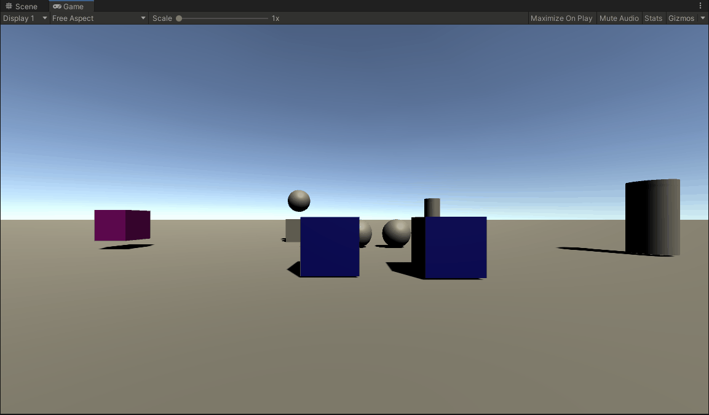
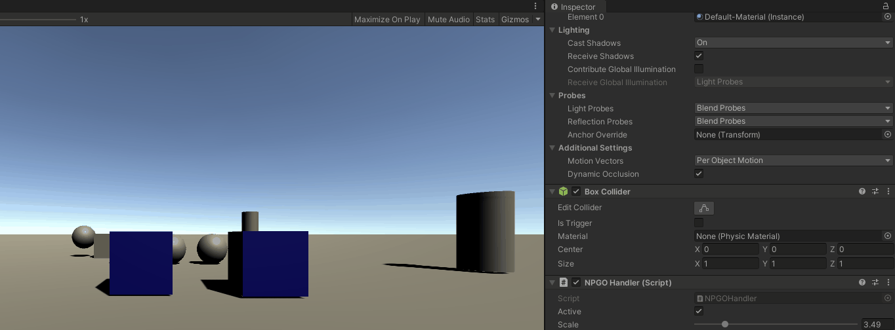
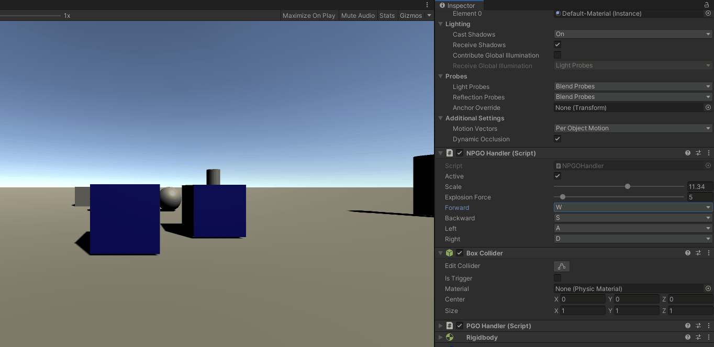
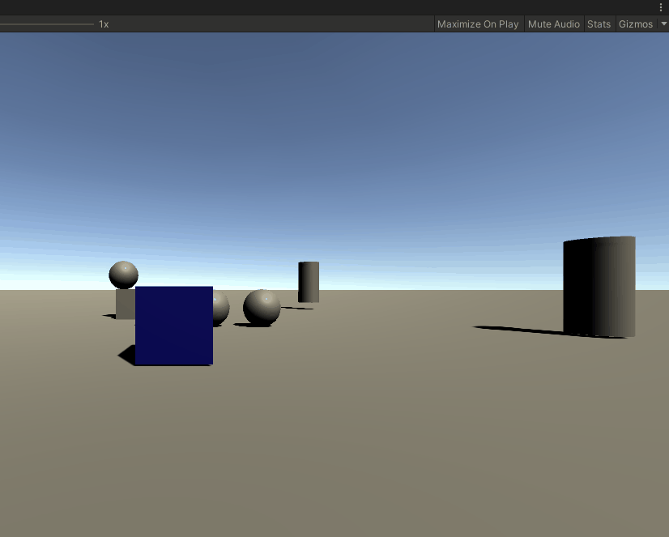
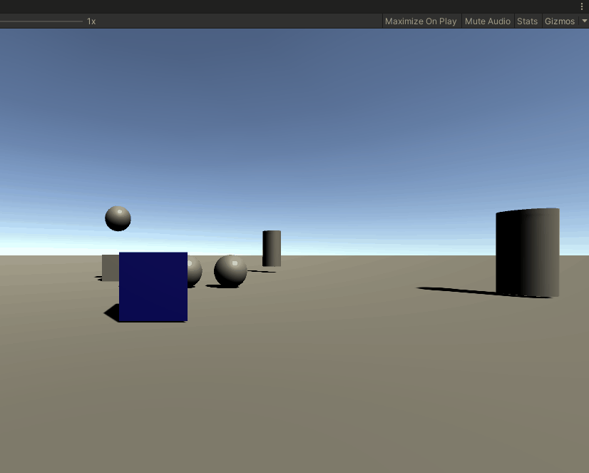
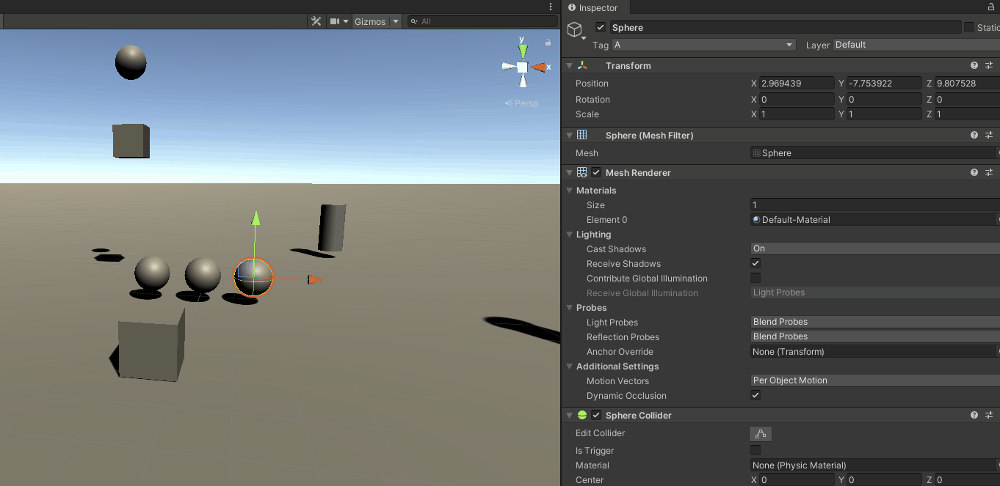
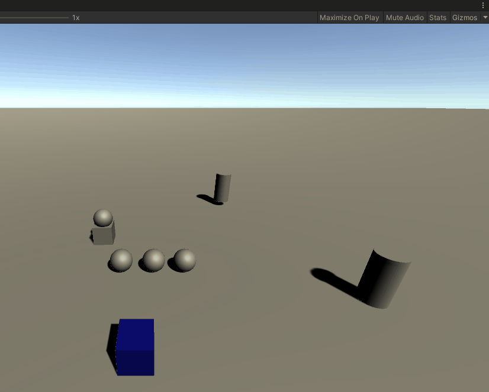
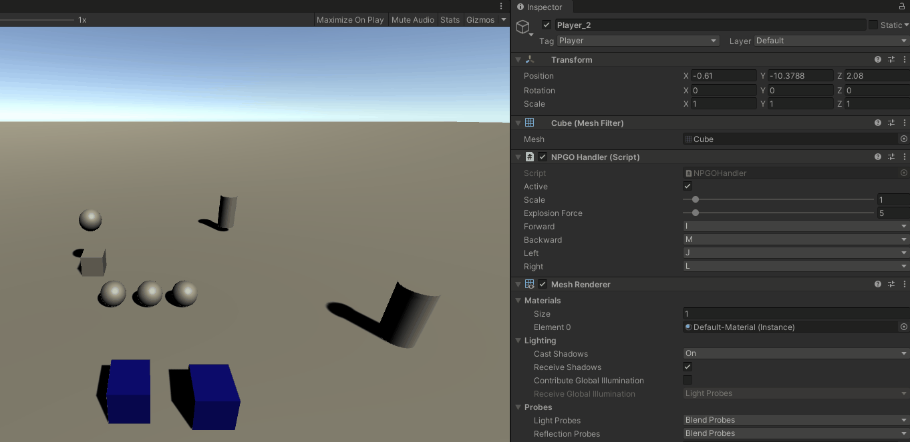
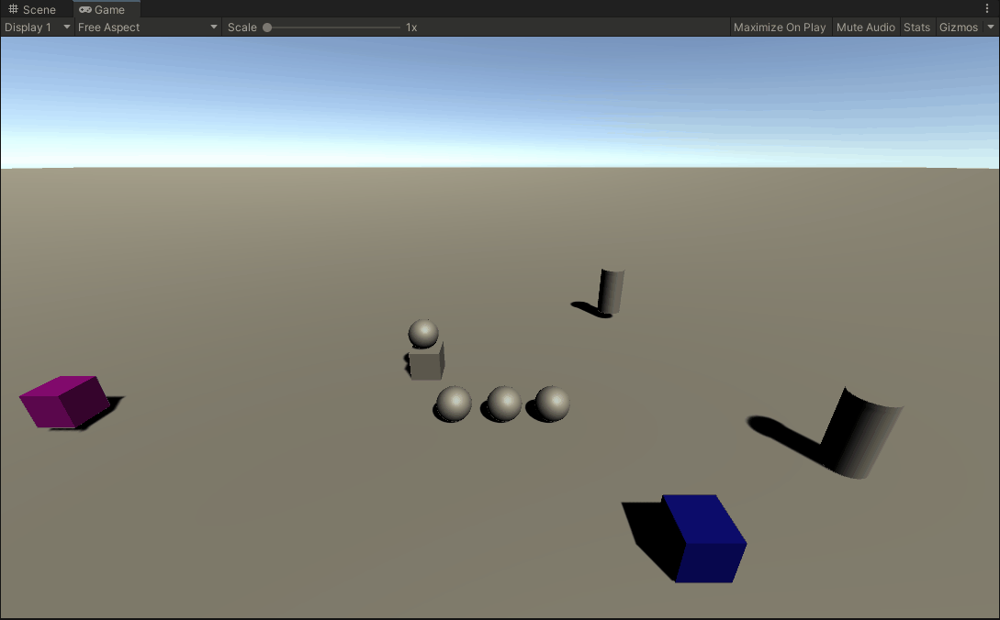

# Practica 2 - Interfaces Inteligentes
## Introducción a los scripts en Unity

## Apartado 1

***1.a) Ninguno de los objetos será físico.**


***1.b) La esfera tiene físicas, el cubo no.**


***1.c) La esfera y el cubo tienen físicas.**


***1.d) La esfera y el cubo son físicos y la esfera tiene 10 veces la masa del cubo**

Los objetos caen a la misma velocidad (esperable en un entorno sin resistencia a la caida, por ej: el vacio)

***1.e) La esfera tiene físicas y el cubo es de tipo IsTrigger**

 Al setear "IsTrigger" al Collider, ahora las colisiones no se manejan por defecto(si hay un Rigidbody adjunto al GO), si no que deberá ser el programador el que, mediante los eventos:
 * OnTriggerEnter()
 * OnTriggerStay()
 * OnTriggerExit()
Manejes las colisiones

***1.f)La esfera tiene físicas, el cubo es de tipo IsTrigger y tiene físicas.**


***1.g)La esfera y el cubo son físicos y la esfera tiene 10 veces la masa del cubo,**
se impide la rotación del cubo sobre el plano XZ.

Antes

Despues


## Apartado 2

***2.a)Crear un script para el personaje que lo desplace por la pantalla, sin aplicar simulación física**

El codigo usado para ello es el siguiente:
```c#
void Update(){
	if (Input.GetKey(KeyCode)forward))
		this.transform.Translate((Vector3.forward * Time.deltaTime) * scale);
	if (Input.GetKey(KeyCode.S))
		this.transform.Translate( (Vector3.back * Time.deltaTime) * scale);
	if (Input.GetKey(KeyCode.A))
		this.transform.Translate((Vector3.left * Time.deltaTime) * scale);
	if (Input.GetKey(KeyCode.D))
		this.transform.Translate((Vector3.right * Time.deltaTime) * scale);
}
```

***2.b)Agregar un campo público que permita graduar la velocidad del movimiento desde el inspector de objetos.**

Para lograr lo anterior, hay que añadir como propiedad del objeto/Script lo siguiente:
```c#
public class NPGOHandler : MonoBehaviour
{
	[Range(0.0f, 20.0f)]
    public float scale = 1.0f;
	.
	.
	.
}
```

***2.c)Estar a la escucha de si el usuario ha utilizado los ejes virtuales. Elegir cuáles se va a permitir utilizar: flechas, awsd**

Esto lo he logrado añadiendo lo siguiente al script:
```c#
public class NPGOHandler : MonoBehaviour
{
    public enum KeyCodeFilter
    {

        W = KeyCode.W,
        S = KeyCode.S,
        A = KeyCode.A,
        D = KeyCode.D,
        Up = KeyCode.UpArrow,
        Down = KeyCode.DownArrow,
        Left = KeyCode.LeftArrow,
        Right = KeyCode.RightArrow,

        I = KeyCode.I,
        L = KeyCode.L,
        J = KeyCode.J,
        M = KeyCode.M
    }

    public KeyCodeFilter forward = (KeyCodeFilter)KeyCode.W;
    public KeyCodeFilter backward = (KeyCodeFilter)KeyCode.S;
    public KeyCodeFilter left = (KeyCodeFilter)KeyCode.A;
    public KeyCodeFilter right = (KeyCodeFilter)KeyCode.D;
	.
	.
	.
}
```

Y modificando parte del codigo anterior:
```c#
void Update(){
	if (Input.GetKey((KeyCode)forward))
	{
		var mov = (Vector3.forward * Time.deltaTime) * scale;
		this.transform.Translate(mov);
	}
	   
	if (Input.GetKey((KeyCode)backward))
	{
		var mov = (Vector3.back * Time.deltaTime) * scale;
		this.transform.Translate(mov);

	}
		
	if (Input.GetKey((KeyCode)left))
	{
		var mov = (Vector3.left * Time.deltaTime) * scale;
		this.transform.Translate(mov);
	}
		
	if (Input.GetKey((KeyCode)right))
	{
		var mov = (Vector3.right * Time.deltaTime) * scale;
		this.transform.Translate(mov);
	}
}

```


***2.d)Elegir otros ejes virtuales para el giro y girar al jugador sobre el eje OY (up).**

Codigo para ello:
```c#
void Update(){
	if (Input.GetKey(KeyCode.Q))
		this.transform.rotation = Quaternion.Euler(0.0f, transform.rotation.eulerAngles.y - 5.0f, 0.0f); //==this.transform.Rotate(0.0f, -0.25f, 0.0f);
		
	if (Input.GetKey(KeyCode.E))
		this.transform.rotation = Quaternion.Euler(0.0f, transform.rotation.eulerAngles.y + 5.0f, 0.0f); //==this.transform.Rotate(0.0f, 0.25f, 0.0f);
}
```

## Apartado 3

***3.a)Se deben incluir varias esferas sobre la escena. Cada vez que el objeto jugador colisione con una esfera se debe cambiar su color. Las esferas deben responder a la física.**

Esto se logra de la siguiente forma:
	1) Se añade un rigidbody a las esferas y al cubo que representa el jugador, que, para el jugador, se logra desde el mismo script de la siguiente forma:
```c#
void Start()
{
	if ((rb = this.GetComponent<Rigidbody>()) == null) //No vamos añadir un RigidBody si ya existe uno
		rb = this.gameObject.AddComponent<Rigidbody>();
	rb.isKinematic = true; //Para seguir manejando el GO con transform
	Application.targetFrameRate = 60;   //Ahora manejaremos todo en FixedUpdate y seteamos los maximos framerates por seg. a 60
}
```	
	2) Se añade el evento que maneja la colision y se le define el comportamiento:
```c#
private void OnCollisionEnter(Collision collision)
{
	Color random = new Color(Random.Range(0.0f,1.0f), Random.Range(0.0f, 1.0f), Random.Range(0.0f, 1.0f));
	collision.gameObject.GetComponent<Renderer>().material.color = random;
}
```
***3.a.2) Y si se trata de una esfera de tipo A, y se pulsa la barra espaciadora el jugador impulsa la esfera hacia fuera de él..**

Lo anterior se logra con el siguiente codigo (dentro de FixedUpdate()):
```c#
  if (Input.GetKeyDown(KeyCode.Space))
	{
		Collider[] colliders = Physics.OverlapSphere(this.transform.position, 10.0f); //Genero una especie de test que crea una esfera virtual, con centro en this.transform.position y radio 10 que detecta con que objetos se choca
		foreach (Collider collider in colliders)
			if(collider.attachedRigidbody != null && collider.gameObject.CompareTag("A"))
				collider.attachedRigidbody.AddExplosionForce(explosionForce, this.transform.position, 10.0f,3.0f,ForceMode.VelocityChange); //Genero la "explosión" que los expulsa fuera
	}
```

***3.b) Se deben incluir cilindros que se alejen del jugador cuando esté próximo.**

Lo anterior se logra de la siguiente forma:
```c#
void alejaCilindros(Vector3 mov)
{ //En mov tengo el desplazamiento del GO asociado al script
	foreach (GameObject cilindro in cilindros)
	{
		if ( //Check para ver si se esta acercando
			Vector3.Distance(transform.position - mov, cilindro.transform.position)
			> /*Me alejo solo si se esta acercando*/
			Vector3.Distance(transform.position, cilindro.transform.position))
		{
			var proportion = 1.0f / Vector3.Distance(this.transform.position, cilindro.transform.position);
			cilindro.transform.Translate(mov * proportion);
		}
	}
}
```

Que es llamado cada vez que el jugador se mueve, por lo tanto, modificando un codigo previo (en void FixedUpdate()):
```c#
 if (Input.GetKey((KeyCode)forward))
{
	var mov = (Vector3.forward * Time.deltaTime) * scale;
	this.transform.Translate(mov);//==this.gameObject.transform.position = this.gameObject.transform.position + (Vector3.forward*Time.deltaTime)* scale;
	alejaCilindros(mov);
}
   
if (Input.GetKey((KeyCode)backward))
{
	var mov = (Vector3.back * Time.deltaTime) * scale;
	this.transform.Translate(mov);
	alejaCilindros(mov);

}
	
if (Input.GetKey((KeyCode)left))
{
	var mov = (Vector3.left * Time.deltaTime) * scale;
	this.transform.Translate(mov);
	alejaCilindros(mov);
}
	
if (Input.GetKey((KeyCode)right))
{
	var mov = (Vector3.right * Time.deltaTime) * scale;
	this.transform.Translate(mov);
	alejaCilindros(mov);
}
```

***3.c) Ubicar un tercer objeto que sea capaz de detectar colisiones y que se mueva con las teclas: I, L, J, M**

Simplemente añade esas teclas a mi enumerable "KeyCodeFilter" (enumerable que cree anteriormente para evitar que me saliesen todas las teclas)
```c#
public class NPGOHandler : MonoBehaviour
{
	public enum KeyCodeFilter
	{

		W = KeyCode.W,
		S = KeyCode.S,
		A = KeyCode.A,
		D = KeyCode.D,
		Up = KeyCode.UpArrow,
		Down = KeyCode.DownArrow,
		Left = KeyCode.LeftArrow,
		Right = KeyCode.RightArrow,
		//Añado lo siguiente:
		I = KeyCode.I,
		L = KeyCode.L,
		J = KeyCode.J,
		M = KeyCode.M
	}
.
.
.
}

```
 Y lo configuro en el inspector ,como se puede ver en el GIF, lo cual modifica las siguientes propiedades:
```c#
public class NPGOHandler : MonoBehaviour
{
	public KeyCodeFilter forward = (KeyCodeFilter)KeyCode.W;
	public KeyCodeFilter backward = (KeyCodeFilter)KeyCode.S;
	public KeyCodeFilter left = (KeyCodeFilter)KeyCode.A;
	public KeyCodeFilter right = (KeyCodeFilter)KeyCode.D;
.
.
.
}

```

***3.d) Debes ubicar cubos que que aumentan de tamaño cuando se le acerca una esfera y que disminuye cuando se le acerca el jugador.**

Lo anterior se logra con el siguiente codigo (En CubeScaleHandler.cs):
```c#
public class CubeScaleHandler : MonoBehaviour
{
    BoxCollider collider;
    // Start is called before the first frame updat
    void Start()
    {
        this.GetComponent<Renderer>().material.color = Color.magenta;
        collider = this.GetComponent<BoxCollider>();
        collider.size *= 7.0f; // Para no complicarnos con funciones costosas que detecten que objeto se acerca, aumentado el tamaño del BoxCollider * 7. Es el truco sin el que este codigo no funcionaría
        collider.isTrigger = true; //Important para que el evento OnTriggerStay se ejecute 
    }

    // Update is called once per frame
    void Update()
    {
        
    }

    private void OnTriggerStay(Collider other)
    {
        Vector3 puntoColision = this.GetComponent<Collider>().ClosestPointOnBounds(other.transform.position);
        float distanciaCollision = Vector3.Distance(transform.position, puntoColision);
        float distancia = 10.0f;
        float aux = distanciaCollision / distancia;
        Vector3 max = new Vector3(5, 5, 5);
        if(other.CompareTag("Player"))
            this.transform.localScale *= 0.9f;
        else if(this.transform.localScale.x < 2 )
            this.transform.localScale *= 1.1f;
    }
}
```

