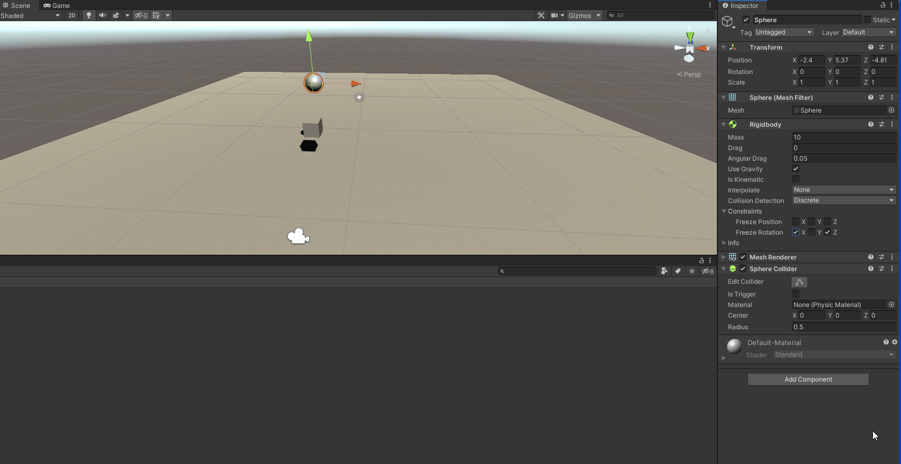

# Practica 2 - Interfaces Inteligentes
## Introducción a los scripts en Unity

*1.a) Ninguno de los objetos será físico.

*1.b) La esfera tiene físicas, el cubo no.

*1.c) La esfera y el cubo tienen físicas.

*1.d) La esfera y el cubo son físicos y la esfera tiene 10 veces la masa del cubo

Los objetos caen a la misma velocidad (esperable en un entorno sin resistencia a la caida, por ej: el vacio)

*1.e) La esfera tiene físicas y el cubo es de tipo IsTrigger

 Al setear "IsTrigger" al Collider, ahora las colisiones no se manejan por defecto, si no que deberá ser el programador el que, mediante los eventos:
 * OnTriggerEnter()
 * OnTriggerStay()
 * OnTriggerExit()
Manejará las colisiones

*1.f)La esfera tiene físicas, el cubo es de tipo IsTrigger y tiene físicas.

*1.e)La esfera y el cubo son físicos y la esfera tiene 10 veces la masa del cubo,
se impide la rotación del cubo sobre el plano XZ.
Antes

Despues

